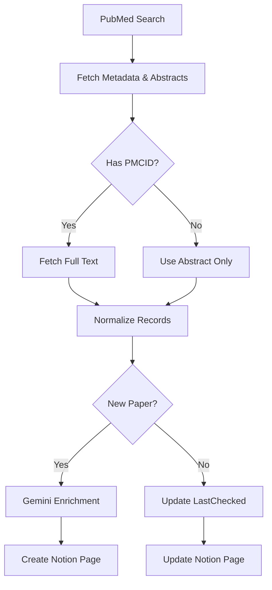

# Literature Search & Triage Pipeline

Automated PubMed → Gemini → Notion workflow for spatial and single‑cell cancer literature.

  

---

## Overview

Searches PubMed, extracts metadata and full text (when available), enriches with Gemini AI analysis, and syncs to Notion.

**Pipeline steps:**
1. Execute tier-based or custom PubMed queries
2. Fetch abstracts, MeSH terms, GEO/SRA accessions, PMC full-text
3. Enrich with Gemini 2.5 Flash (relevance scores, summaries, methods, data types, findings)
4. Create/update Notion pages with deduplication and field validation

**Modular architecture:**
- `literature_flow.py` — main orchestrator
- `pubmed_tasks.py` — NCBI E-utilities integration
- `enrichment.py` — Gemini AI enrichment
- `notion_tasks.py` — Notion API sync
- `config.py`, `http_utils.py`, `normalization.py`, `validation_tasks.py` — core utilities

---

## Key Features

**Discovery Strategy**
- **Tier 1** (default): Prostate cancer + spatial/single‑cell/multiome
- **Tier 2**: Pan-cancer spatial methods
- **Custom queries**: Override with any PubMed search term

**AI Enrichment**
- Gemini 2.5 Flash with enforced JSON schema
- Extracts: `RelevanceScore` (0–100), `StudySummary`, `Methods`, `KeyFindings`, `DataTypes`
- Temperature 0.1 for deterministic scoring

**Cost & Safety Controls**
- Enriches only new papers (skips existing Notion entries)
- 2000-char truncation for Notion API compliance
- Retry logic with exponential backoff (429/5xx)
- Optional gold-set validation for query drift detection

---

## Quick Start

**1. Install**
```bash
git clone https://github.com/yourusername/LiteratureSearch.git
cd LiteratureSearch
python -m venv venv
source venv/bin/activate  # Windows: venv\Scripts\activate
pip install -r requirements.txt
```

**2. Configure**

Create `.env` in project root:
```env
NCBI_API_KEY=your_ncbi_api_key
NCBI_EMAIL=your.email@institution.edu
GOOGLE_API_KEY=your_gemini_api_key
NOTION_TOKEN=secret_notion_token
NOTION_DB_ID=xxxxxxxxxxxxxxxxxxxxxxxxxxxxxxxx
```

**3. Run**
```bash
# Tier 1 (prostate-focused, default)
python literature_flow.py

# Tier 2 (pan-cancer methods)
python literature_flow.py --tier 2

# Custom query
python literature_flow.py --query '("Prostatic Neoplasms"[MeSH]) AND ("spatial transcriptomics"[tw])'

# Dry run (no Notion writes)
python literature_flow.py --dry-run
```

---

## Workflow



---

## Notion Schema

**Required properties:**

| Property | Type | Description |
| :--- | :--- | :--- |
| `Title` | Title | Paper title |
| `RelevanceScore` | Number | AI score (0-100) |
| `StudySummary` | Text | AI-generated summary |
| `DataTypes` | Multi-select | e.g., `10x Visium`, `scRNA-seq` |
| `Methods` | Text | Extracted methods |
| `KeyFindings` | Text | Biological insights |
| `PMID` | Text | PubMed ID |
| `DOI` | Text | Digital Object Identifier |
| `URL` | URL | PubMed link |
| `DedupeKey` | Text | DOI or `PMID:{id}` |
| `LastChecked` | Date | Sync timestamp |

---

## CLI Flags

| Flag | Purpose | Default |
|------|---------|---------|
| `--tier` | Query tier (1=prostate, 2=pan-cancer) | 1 |
| `--query` | Custom PubMed query (overrides tier) | None |
| `--reldays` | Look-back window (days) | 365 |
| `--retmax` | Max results to process | 220 |
| `--dry-run` | Skip Notion writes | False |

---

## Contributing

PRs welcome for vocabulary expansions, prompt improvements, or bug fixes. Open an issue before major architectural changes.

## License

MIT License. See `LICENSE`.
