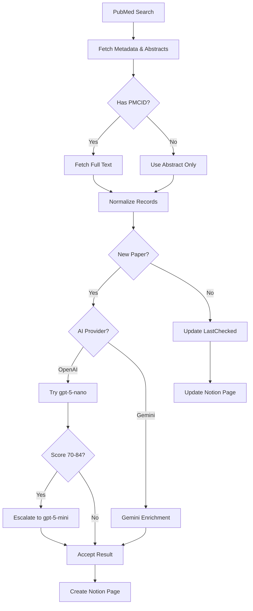

# Literature Search & Triage Pipeline

Automated PubMed → AI → Notion workflow for spatial and single‑cell cancer literature.

  

---

## Overview

Searches PubMed, extracts metadata and full text (when available), enriches with AI analysis (Gemini or OpenAI), and syncs to Notion.

**Pipeline steps:**
1. Execute tier-based or custom PubMed queries
2. Fetch abstracts, MeSH terms, GEO/SRA accessions, PMC full-text
3. Enrich with AI (relevance scores, summaries, methods, data types, findings)
4. Create/update Notion pages with deduplication and field validation

**Modular architecture:**
- `literature_flow.py` — main orchestrator
- `pubmed_tasks.py` — NCBI E-utilities integration
- `enrichment.py` — Multi-provider AI enrichment (Gemini + OpenAI)
- `notion_tasks.py` — Notion API sync
- `config.py`, `http_utils.py`, `normalization.py`, `validation_tasks.py` — core utilities

---

## Key Features

**Discovery Strategy**
- **Tier 1** (default): Prostate cancer + spatial/single‑cell/multiome
- **Tier 2**: Pan-cancer spatial methods
- **Custom queries**: Override with any PubMed search term

**Multi-Provider AI Enrichment**
- **Gemini**: gemini-2.5-flash with enforced JSON schema
- **OpenAI**: Nano-First strategy with automatic escalation
  - Default: `gpt-5-nano` ($0.05/1M tokens)
  - Auto-escalate to `gpt-5-mini` ($0.25/1M tokens) for ambiguous scores (70-84)
- Extracts: `RelevanceScore` (0–100), `StudySummary`, `Methods`, `KeyFindings`, `DataTypes`, `Group`
- Temperature optimized per provider (1.0 for GPT-5 models, 0.1 for others)

**Cost Optimization**
- Nano-First strategy: Process 90% of papers at ultra-low cost, escalate only when needed
- Enriches only new papers (skips existing Notion entries)
- Automatic escalation on low confidence or ambiguous relevance
- Token tracking with TPM monitoring

**Safety Controls**
- 2000-char truncation for Notion API compliance
- Retry logic with exponential backoff (429/5xx)
- Quota exhaustion detection with detailed error reporting
- Optional gold-set validation for query drift detection

---

## Quick Start

**1. Install**
```bash
git clone https://github.com/yourusername/LiteratureSearch.git
cd LiteratureSearch
python -m venv venv
source venv/bin/activate  # Windows: venv\Scripts\activate
pip install -r requirements.txt
```

**2. Configure**

Create `.env` in project root:
```env
NCBI_API_KEY=your_ncbi_api_key
NCBI_EMAIL=your.email@institution.edu
NOTION_TOKEN=secret_notion_token
NOTION_DB_ID=xxxxxxxxxxxxxxxxxxxxxxxxxxxxxxxx

# AI Provider: choose "gemini" or "openai"
AI_PROVIDER=openai

# Gemini API (if using AI_PROVIDER=gemini)
GOOGLE_API_KEY=your_gemini_api_key

# OpenAI API (if using AI_PROVIDER=openai)
OPENAI_API_KEY=sk-proj-your-key-here
```

**3. Run**
```bash
# Tier 1 (prostate-focused, default)
python literature_flow.py

# Tier 2 (pan-cancer methods)
python literature_flow.py --tier 2

# Process 50 papers
python literature_flow.py --retmax 50

# Custom query
python literature_flow.py --query '("Prostatic Neoplasms"[MeSH]) AND ("spatial transcriptomics"[tw])'

# Dry run (no Notion writes)
python literature_flow.py --dry-run
```

---

## AI Provider Configuration

### OpenAI (Recommended for Cost Efficiency)

**Nano-First Strategy:**
- Primary: `gpt-5-nano` processes all papers initially
- Escalation triggers:
  - Ambiguous relevance score (70-84)
  - JSON parsing failures
  - Low confidence results
- Escalation target: `gpt-5-mini` for better reasoning

**Cost per 50 papers:** ~$0.01 (Nano) + $0.005 (escalations) = **~$0.015 total**

**Capacity with $5 credit:** ~15,000+ papers

### Gemini (Alternative)

**Model:** gemini-2.5-flash

**Note:** Free tier limited to 20 requests/day. Enable billing for production use.

---

## Workflow



---

## Notion Schema

**Required properties:**

| Property | Type | Description |
| :--- | :--- | :--- |
| `Title` | Title | Paper title |
| `RelevanceScore` | Number | AI score (0-100) |
| `StudySummary` | Text | AI-generated summary |
| `DataTypes` | Multi-select | e.g., `10x Visium`, `scRNA-seq` |
| `Methods` | Text | Extracted methods |
| `KeyFindings` | Text | Biological insights |
| `Group` | Text | PI/Lab/Corresponding author |
| `PipelineConfidence` | Select | Low, Medium, Medium-Ambiguous, High |
| `FullTextUsed` | Checkbox | Whether full-text was analyzed |
| `PMID` | Text | PubMed ID |
| `DOI` | Text | Digital Object Identifier |
| `URL` | URL | PubMed link |
| `DedupeKey` | Text | DOI or `PMID:{id}` |
| `LastChecked` | Date | Sync timestamp |

---

## CLI Flags

| Flag | Purpose | Default |
|------|---------|---------|
| `--tier` | Query tier (1=prostate, 2=pan-cancer) | 1 |
| `--query` | Custom PubMed query (overrides tier) | None |
| `--reldays` | Look-back window (days) | 365 |
| `--retmax` | Max results to process | 220 |
| `--dry-run` | Skip Notion writes | False |

---

## Advanced Configuration

### Rate Limiting

Current setting: `time.sleep(0.3)` between API calls (~100-120 RPM)

Safe for OpenAI's 500 RPM limit. Adjust in `modules/enrichment.py` if needed.

### Model Selection

Edit `modules/enrichment.py` to change models:
```python
DEFAULT_MODEL = "gpt-5-nano"      # Primary model
ESCALATION_MODEL = "gpt-5-mini"   # Fallback for ambiguous cases
```

Available OpenAI models:
- `gpt-5-nano`: Ultra-low cost ($0.05/1M input)
- `gpt-5-mini`: Balanced ($0.25/1M input)
- `gpt-4o-mini`: Proven stable ($0.15/1M input)

---

## Troubleshooting

**OpenAI Temperature Error:**
> `Unsupported value: 'temperature' does not support 0.1`

GPT-5 models require `temperature=1.0`. This is automatically handled by checking if `"gpt-5"` is in the model name.

**Quota Exceeded:**

Pipeline automatically stops on quota errors to prevent corrupted Notion data. Check:
- Gemini: Verify billing is enabled (free tier = 20 requests/day)
- OpenAI: Check usage dashboard at platform.openai.com

**Escalation Not Triggering:**

Escalation only occurs when:
- `RelevanceScore` is between 70-84 (ambiguous zone)
- JSON parsing fails on first attempt
- Result marked as low confidence

---

## Contributing

PRs welcome for vocabulary expansions, prompt improvements, or bug fixes. Open an issue before major architectural changes.

## License

MIT License. See `LICENSE`.
