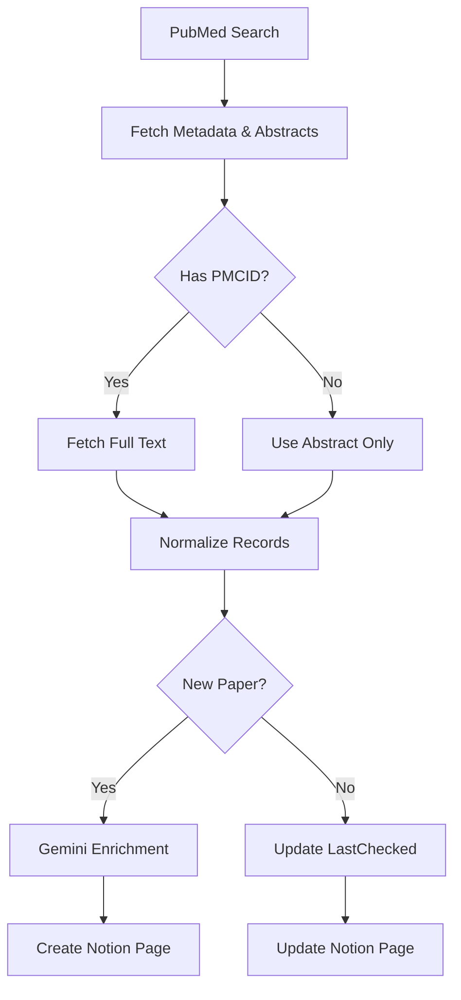

# Literature Search & Triage Pipeline

> **Automated PubMed → Gemini → Notion workflow for cancer spatial/single-cell literature triage.**

  

---

## Overview

Welcome to your new favorite research assistant. This pipeline is designed for computational oncology researchers who need to stay on top of the explosion in spatial transcriptomics and single-cell studies without drowning in PubMed alerts.

**What it does:**
1.  **Scouts the Literature**: Runs two-tier PubMed queries (Prostate-focused or Pan-cancer methods).
2.  **Digs Deeper**: Extracts abstracts, MeSH terms, GEO/SRA accessions, and even PMC full-text when available.
3.  **Reads for You**: Uses **Gemini 2.5 Flash** to read the papers and extract structured insights (`RelevanceScore`, `KeyFindings`, `DataTypes`, etc.).
4.  **Keeps it Organized**: Syncs everything to a tidy Notion database, handling deduplication and formatting automatically.

**Under the Hood:**
The system is built on a **modular architecture** for easy maintenance. Key components include:
-   `Prefect_literatureSearch.py`: The main orchestrator.
-   `pubmed_tasks.py`: Handles all things NCBI.
-   `enrichment.py`: The AI brain (Gemini integration).
-   `notion_tasks.py`: The database sync layer.

---

## Key Features

### Precision Discovery
-   **Tier 1 (Default)**: Laser-focused on **Prostate Cancer + Spatial/Single-Cell/Multiome**.
-   **Tier 2**: Broader net for **Pan-cancer spatial methods** (great for finding new tools).
-   **Custom Queries**: Want to search for something else? Just pass a custom query string.

### AI-Powered Enrichment
We don't just keyword match. We use **Gemini** to understand the paper:
-   **Relevance Score (0-100)**: So you can sort by what matters.
-   **Structured Extraction**: `StudySummary`, `Methods`, `KeyFindings`, and `DataTypes` (e.g., "10x Visium", "Xenium").
-   **JSON Mode**: Enforced schema means no broken data.

### Robust & Safe
-   **Cost-Aware**: Only enriches *new* papers.
-   **Notion-Safe**: Truncates long text to avoid API errors and sanitizes inputs.
-   **Gold-Set Validation**: Warns you if the search query starts missing known landmark papers.

---

## Quick Start

### 1. Setup
Clone the repo and set up your environment:

```bash
git clone https://github.com/yourusername/LiteratureSearch.git
cd LiteratureSearch
python -m venv venv
source venv/bin/activate  # Windows: venv\Scripts\activate
pip install -r requirements.txt
```

### 2. Configure Secrets
Create a `.env` file in the root directory:

```env
NCBI_API_KEY=your_ncbi_api_key
NCBI_EMAIL=your.email@institution.edu
GOOGLE_API_KEY=your_gemini_api_key
NOTION_TOKEN=secret_notion_token
NOTION_DB_ID=xxxxxxxxxxxxxxxxxxxxxxxxxxxxxxxx
```

### 3. Run It
Fire up the pipeline with the main script:

```bash
# Tier 1: Prostate-focused (Default)
python Prefect_literatureSearch.py

# Tier 2: Broader cancer methods
python Prefect_literatureSearch.py --tier 2

# Custom Query
python Prefect_literatureSearch.py --query '("Prostatic Neoplasms"[MeSH]) AND ("spatial transcriptomics"[tw])'

# Dry Run (Test without writing to Notion)
python Prefect_literatureSearch.py --dry-run
```

---

## Workflow Visualization



---

## Notion Schema

Your Notion database will be populated with these fields:

| Property | Type | Description |
| :--- | :--- | :--- |
| `Title` | Title | Paper title |
| `RelevanceScore` | Number | **0-100** (Sort by this!) |
| `StudySummary` | Text | AI-generated summary |
| `DataTypes` | Multi-select | e.g., `10x Visium`, `scRNA-seq` |
| `Methods` | Text | Key methods used |
| `KeyFindings` | Text | Biological insights |
| `PMID` | Text | PubMed ID |
| `DOI` | Text | Link to paper |
| `URL` | URL | Link to PubMed |

---

## Contributing

Got a better prompt for Gemini? Found a bug? PRs are welcome!
Please open an issue before making major architectural changes.

---

## License

MIT License. See `LICENSE` for details.

---

*Built with ❤️ for science.*
